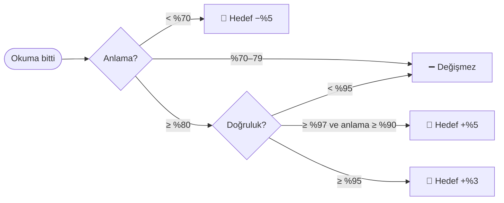
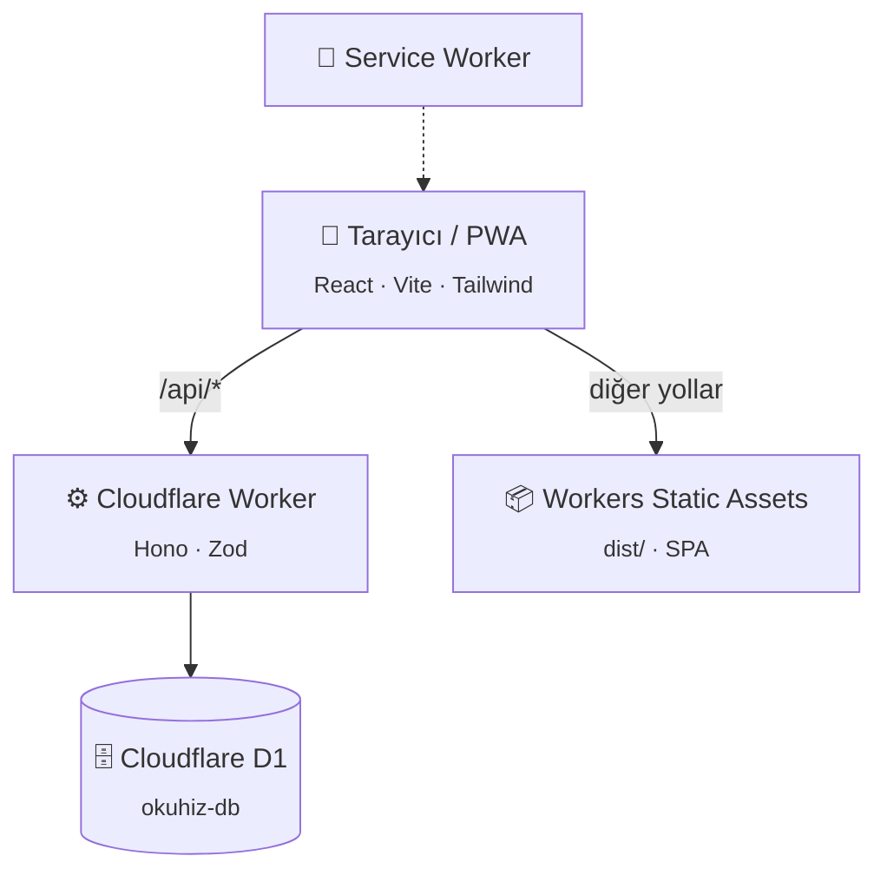
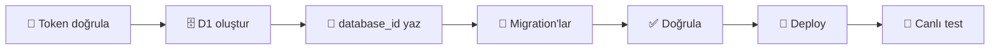

<div align="center">


# OkuHız

### Çocuklar için akıllı okuma antrenörü 📚✨

Hızlı okumak değil, **anlayarak ve akıcı okumak.**
9 yaş civarındaki ilkokul öğrencileri için oyunlaştırılmış, kendi seviyesine uyum sağlayan bir web uygulaması.

<br />

[](https://okuhiz.mlakin.workers.dev)

<br />


</div>

---

## 🎯 Neden OkuHız?

Pek çok okuma uygulaması yalnızca hızı ödüllendirir. OkuHız'da başarı **birlikte** ölçülür ve öncelik sırası bellidir:

<div align="center">

| 1️⃣ | 2️⃣ | 3️⃣ | 4️⃣ |
|:---:|:---:|:---:|:---:|
| 🧠 **Okuduğunu anlama** | 🎯 **Doğru okuma** | 🌊 **Akıcılık** | ⚡ **Okuma hızı** |

</div>

Bunlara ek olarak **düzenli çalışma** (günlük seri) ve **zaman içindeki gelişim** (hareketli ortalama) izlenir. Çocuk hızlı ama anlamadan okursa hedefi yükselmez, düşer.

---

## ✨ Özellikler

<table>
<tr>
<td width="50%" valign="top">

### 📖 Okuma
- **Seviye testi:** kısa bir metin ve 5 soruyla başlangıç hedefi belirlenir
- **3 okuma modu**
  - 📄 *Normal:* çocuk kendi hızında okur
  - 🖍️ *Kelime takip:* kelimeler hedef hızda vurgulanır; süre hece sayısına göre dağıtılır (uzun kelimeye daha çok süre), noktalamadan sonra hıza göre bekleme (virgülde en az 150 ms, cümle sonunda en az 300 ms; yavaş hızlarda orantılı olarak uzar, paragraf sonunda daha uzun)
  - 🧩 *Kelime grupları:* metin Türkçe dil bilgisine göre anlam öbeklerine bölünür ([`shared/chunking.ts`](shared/chunking.ts)): noktalama, paragraf ve tırnak sınırları hiç aşılmaz; "bir/bu/her" ve sayılar sonraki kelimeden, "de/da, ki, mi, için, gibi, önce…" önceki kelimeden, birleşik fiiller ("ziyaret etmek") birbirinden ayrılmaz; zarf-fiil ve hâl ekleri doğal sınır sayılır. Öbek uzunluğu seviyeye göre 2–4 kelime. Kurallar 102 metnin tamamında otomatik testle doğrulanır
- **Tekrarlı okuma:** aynı metin günde 3 kez okunabilir
  > *"İlk okumaya göre %21 daha akıcı okudun."*

</td>
<td width="50%" valign="top">

### ⏱️ 1 Dakika Okuma Testi
- Sözlü okuma akıcılığı ölçümü (ORF benzeri): çocuk 60 saniye sesli okur
- Süre dolunca **sesli uyarı + titreşim**, metin donar, çocuk son okuduğu kelimeye dokunur
- Süre dolmadan bitirirse "Bitirdim" ile süre durur, hız gerçek süreye göre hesaplanır
- Yetişkin dinlediyse hata sayısı girilir → **dakikada doğru okunan kelime (WCPM)**
- Sonuçlar backend'de hesaplanır ve doğrulanır; geçmiş, rekor ve ebeveyn panelinde tablo
- XP: test +10 · rekor +10 · metni dakika dolmadan bitirme +5 · rozetler: İlk Dakika, Rekor Kırıcı, Düzenli Ölçüm, Dakikada 60 / 80 / 100 / 120

### 🎮 Kelime oyunları (6)
- ✅ **Doğru mu Yanlış mı?** 90 saniyede kısa cümleleri oku, doğru/yanlış diye karar ver. Sessiz okuma akıcılığı testlerindeki (TOSREC) göreve dayanır; yanlış cevaplar net puandan düşer
- 🔗 **Kelime Zinciri:** boşluksuz yazılmış kelimeleri ayır (`kedikuşbalık` → kedi · kuş · balık). Kelime tanıma akıcılığı testlerindeki (TOSWRF) göreve dayanır
- 🧱 **Heceleri Birleştir:** karışık heceleri sıraya diz. Heceler Türkçe kurallarına göre otomatik bölünür
- 👁️ **Kelimeyi Yakala:** kelime kısa süre görünür; doğru bildikçe süre kısalır (250–1500 ms)
- 💬 **Cümleyi Hatırla:** cümleyi oku, ayrıntıyı hatırla
- 🧩 **Eksik Kelime:** boşluğa anlamca ve dilbilgisi olarak uyan kelimeyi seç

### ⏱️ Günlük antrenman (10 dk)
2 dk ısınma oyunu (her gün farklı) → 4 dk okuma → 2 dk tekrar → 2 dk sorular

</td>
</tr>
<tr>
<td width="50%" valign="top">

### 🏆 Oyunlaştırma
- ⭐ XP, 🌟 1–3 yıldız, 🔥 günlük seri, 🏅 22 rozet
- 🚫 **Sıralama tablosu yok, çocuklar birbiriyle karşılaştırılmaz**
- 🦊 8 hazır SVG avatar: baykuş, kedi, tilki, ayı, tavşan, panda, aslan, kurbağa

</td>
<td width="50%" valign="top">

### 👨‍👩‍👧 Ebeveyn paneli
- Son 7 gün · 30 gün · tüm zamanlar
- Hız, doğruluk, anlama, çalışma süresi, kelime ve oturum sayısı
- 📈 Gelişim grafiği: tek günlük uç değerler yanıltmasın diye **7 günlük hareketli ortalama**
- Son okumalar tablosu, profil ve hedef ayarı

</td>
</tr>
<tr>
<td width="50%" valign="top">

### 🔑 Hesap ve cihazlar
- **Kullanıcı adı + şifre**, e-posta gerekmez
- Aynı hesapla telefon, tablet ve bilgisayardan gelişim takip edilir
- İsterseniz hesapsız, "sadece bu cihaz" modunda başlayıp sonra hesap ekleyebilirsiniz
- Şifre değiştirme (diğer cihazlardaki oturumları kapatır) ve çıkış

### 📱 PWA
- Ana ekrana eklenir, tam ekran açılır
- İnternet yokken de açılır (uygulama kabuğu önbellekte)
- Çevrimdışı uyarısı ve "yeni sürüm hazır" bildirimi

</td>
<td width="50%" valign="top">

### 📚 İçerik
- **101** özgün Türkçe metin (+ seviye testi) · **10** kategori
- Uzay, Hayvanlar, Bilim, Doğa, Macera, Spor, Teknoloji, Günlük Yaşam, Tarih, Keşif
- **846** anlama sorusu: her metnin 8–9 soruluk havuzu var, her okumada **5 soru** seçilir; tekrar okumada farklı sorular gelir
- **530** oyun maddesi (150 kelime · 100 cümle · 100 eksik kelime · 180 doğru/yanlış cümlesi); kelime zinciri ve hece oyunları 600'ü aşkın kelimelik sözlükten otomatik üretilir
- Kütüphanede okunan metinler ✅ farklı renkte, en iyi yıldızıyla gösterilir; "Yeni / Okuduklarım", zorluk ve kategori filtreleri

</td>
</tr>
</table>

---

## 🧠 Adaptif hedef algoritması

Her okumadan sonra çocuğun hedef hızı **backend'de** yeniden hesaplanır: [`shared/reading.ts`](shared/reading.ts) → `calculateNextTarget()`



| Ek güvence | Neden |
|---|---|
| Hedef **40–200 WPM** arasında kalır | Aşırı uçları önlemek için |
| Çocuk mevcut hedefin **%90'ına ulaşmadıysa** hedef artmaz | Hızı zorlamamak için |
| Doğruluk ölçülmediyse artış en fazla **+%3** olur | Eksik veriyle temkinli olmak için |
| Seviye testinden gelen başlangıç hedefi en fazla **150 WPM** olur | Göz gezdirmeyi okuma saymamak için |

<details>
<summary><b>⭐ XP tablosu</b></summary>

| Olay | XP |
|---|:---:|
| Okumayı tamamlama | +10 |
| Anlama ≥ %80 | +10 |
| Doğruluk ≥ %95 | +10 |
| Günün ilk çalışması | +5 |
| Tekrar okuma | +5 |
| Oyun tamamlama (≥ %80 doğruysa +5 daha) | +5 |

</details>

<details>
<summary><b>🎯 Doğru okuma oranı nasıl ölçülür?</b></summary>

MVP'de ses tanıma yoktur ve **ses kaydı alınmaz.** Çocuk sesli okurken bir yetişkin dinlediyse, okuma sonunda takıldığı ya da yanlış okuduğu kelime sayısını girer:

```
doğruluk = (kelime sayısı − hata) / kelime sayısı × 100
```

Girilmezse doğruluk "ölçülmedi" olarak kaydedilir ve algoritma yalnızca anlamaya göre çalışır.

</details>

---

## 🏗️ Mimari

**%100 Cloudflare Free plan.** Kredi kartı gerekmez, ücretli servis kullanılmaz.



| ✅ Kullanılanlar | 🚫 Kullanılmayanlar |
|---|---|
| Workers · Static Assets · D1 | R2 · KV · Durable Objects |
| SVG avatarlar, Lucide ikonlar | Görsel yükleme |
| Uygulamayla birlikte sunulan fontlar (`@fontsource`) | Google Fonts, analitik, reklam |
| Hazır metinler (D1'de) | OpenAI / Anthropic / Gemini, ücretli ses tanıma |

> 💡 Gelecekte yapay zekâ ile metin üretimi eklenebilsin diye yalnızca bir arayüz hazır: [`shared/content-generation.ts`](shared/content-generation.ts). MVP'de kullanılmaz.

---

## 🚀 Hızlı başlangıç

```bash
npm install
npm run db:migrate:local     # yerel D1 veritabanını oluşturur ve seed verisini yükler
npm run build                # frontend → dist/
npm run dev:api              # 👉 http://localhost:8787  (API + yerel D1 + frontend)
```

Arayüz üzerinde çalışırken anlık yenileme (HMR) için ikinci bir terminalde `npm run dev` çalıştırın (`http://localhost:5173`; `/api` istekleri 8787'ye yönlendirilir).

| Komut | Ne yapar? |
|---|---|
| `npm test` | 🧪 Birim testleri: WPM, doğruluk, adaptif algoritma, seri, hareketli ortalama, tempo, hız sınırı |
| `npm run typecheck` | 🔍 Frontend ve Worker tip kontrolü |
| `npm run test:smoke [URL]` | 💨 Uçtan uca test: API, frontend, PWA, güvenlik başlıkları |
| `npm run seed:generate` | 🌱 `seed/texts.json` → `0003_seed.sql`, `seed/texts-extra/*.json` → `0004_more_texts.sql` (kelime sayıları otomatik) |
| `npm run setup:cloudflare` | ☁️ Tek komutla Cloudflare kurulumu ve deploy (aşağıda) |

---

## ☁️ Tek komutla Cloudflare'e yayınlama

Dashboard'a girmeniz gerekmez. Token'ı ortam değişkeni olarak veya git'e girmeyen `.env` dosyasında verin:

```bash
export CLOUDFLARE_API_TOKEN=...      # 🔒 asla koda veya repoya yazmayın
export CLOUDFLARE_ACCOUNT_ID=...     # isteğe bağlı; token tek hesaba erişiyorsa otomatik bulunur
npm run setup:cloudflare
```



[`scripts/setup-cloudflare.mjs`](scripts/setup-cloudflare.mjs) tekrar tekrar çalıştırılabilir: veritabanı varsa yenisini oluşturmaz, onu kullanır. Canlı testin oluşturduğu veriler en sonda silinir.

<details>
<summary><b>🔑 Gerekli token izinleri</b></summary>

| Kapsam | İzin |
|---|---|
| Account | Workers Scripts: **Edit** |
| Account | D1: **Edit** |
| Account | Account Settings: **Read** |
| User | User Details: **Read** (`wrangler whoami` için) |

workers.dev alt alanınız yoksa betik onu da kaydeder (Workers Scripts: Edit izni bunu kapsar).

</details>

---

## 🔐 Güvenlik ve gizlilik

<table>
<tr><td>🧮</td><td><b>Skorlar backend'de hesaplanır.</b> İstemci yalnızca süreyi gönderir; WPM, D1'deki kelime sayısından hesaplanır. Doğru cevaplar istemciye hiç gönderilmez. 350 WPM üzeri okuma "metni atlama" sayılıp reddedilir.</td></tr>
<tr><td>🛡️</td><td><b>Sıkı CSP ve güvenlik başlıkları:</b> satır içi betik yok, çerçeveleme yasak, <code>nosniff</code>, HSTS (<a href="public/_headers"><code>public/_headers</code></a>, <code>hono/secure-headers</code>).</td></tr>
<tr><td>🚦</td><td><b>Kötüye kullanıma karşı:</b> IP başına hız sınırı, 16 KB istek sınırı, yazma isteklerinde <code>Origin</code> kontrolü, Zod doğrulaması, parametreli SQL.</td></tr>
<tr><td>🔑</td><td><b>Şifreler:</b> PBKDF2-SHA256 + tuz + gizli "pepper" (Worker secret) ile saklanır. Oturum token'larının yalnızca SHA-256 özeti tutulur. Girişte IP ve kullanıcı adı başına deneme sınırı vardır; hatalı giriş mesajı kullanıcı adının var olup olmadığını belli etmez.</td></tr>
<tr><td>👶</td><td><b>Veri minimizasyonu:</b> e-posta, şifre, ses kaydı ve fotoğraf toplanmaz. Üçüncü taraflara istek gitmez. Service worker çocuk verisini önbelleğe almaz.</td></tr>
<tr><td>🔒</td><td><b>Gizli bilgiler repoda yok:</b> token yalnızca ortam değişkeninde veya <code>.env</code> dosyasında durur. CI secret kullanmaz ve deploy yapmaz.</td></tr>
</table>

Tehdit modeli ve açık bildirme için 👉 **[SECURITY.md](SECURITY.md)**

> ℹ️ **Hesapsız mod:** "Sadece bu cihaz" seçildiğinde şifre yoktur; aile kimliği tarayıcıda saklanan, tahmin edilemeyen bir UUID'dir (`X-Parent-Id`). Kullanıcı adı ve şifre belirlendiği anda bu kimlik geçersizleşir ve yalnızca oturum token'ı (`Authorization: Bearer`) kabul edilir.

---

## 📡 API

Tüm yanıtlar aynı biçimdedir:

```jsonc
{ "success": true,  "data": { /* ... */ } }
{ "success": false, "error": { "code": "VALIDATION_ERROR", "message": "..." } }
```

<details>
<summary><b>📋 Tüm uç noktalar</b></summary>

| Yöntem | Yol | Açıklama |
|:---:|---|---|
| `GET` | `/api/health` | Sağlık durumu ve D1 bağlantısı |
| `POST` | `/api/auth/register` | Kullanıcı adı + şifreyle aile oluştur → oturum token'ı |
| `POST` | `/api/auth/login` | Giriş → oturum token'ı |
| `POST` | `/api/auth/credentials` | Hesapsız aileye kullanıcı adı ve şifre ekle |
| `POST` | `/api/auth/password` | Şifre değiştir (diğer oturumlar kapanır) |
| `POST` | `/api/auth/logout` | Çıkış (oturumu sil) |
| `GET` | `/api/auth/me` | Oturumdaki aile ve çocukları |
| `POST` | `/api/parents` | Hesapsız ("sadece bu cihaz") aile oluştur |
| `GET` | `/api/parents/:id` | Aile ve çocukları |
| `POST` | `/api/children` | Çocuk profili oluştur |
| `GET` `PUT` | `/api/children/:id` | Profili getir / güncelle (ad, sınıf, avatar, hedef WPM) |
| `GET` | `/api/children/:id/today` | Ana ekran: hedefler, seri, bugünün özeti, önerilen metin ve mod |
| `GET` | `/api/children/:id/stats?range=7\|30\|all` | Özet metrikler |
| `GET` | `/api/children/:id/progress?range=…` | Günlük seri, hareketli ortalama, son okumalar |
| `GET` | `/api/children/:id/reading-history` | Okunan metinler: kaç kez, en iyi hız ve anlama |
| `GET` | `/api/children/:id/achievements` | Kazanılan ve kilitli rozetler |
| `GET` | `/api/texts` · `/api/texts/:id` | Metin listesi / metin ve sorular (cevaplar hariç) |
| `POST` | `/api/reading/start` | Okuma oturumu başlat → havuzdan seçilen 5 soru |
| `POST` | `/api/reading/:id/finish` | Süre (+ isteğe bağlı hata sayısı) → WPM, XP, tekrar karşılaştırması |
| `POST` | `/api/reading/:id/answers` | Cevaplar → anlama skoru, yıldız, yeni hedef |
| `POST` | `/api/games/result` | Oyun sonucu |
| `POST` | `/api/minute/start` | 1 dakika testi başlat (seviyeye uygun metin seçilir) |
| `POST` | `/api/minute/:id/finish` | Süre, okunan kelime, isteğe bağlı hata → WCPM, rekor, XP, rozet |
| `GET` | `/api/children/:id/minute-tests` | 1 dakika testi geçmişi ve en iyi sonuç |

</details>

---

## 🗂️ Proje yapısı

```
okuhiz/
├── 🧩 shared/        Ortak kurallar (WPM, algoritma, tempo, XP), API tipleri ve testler
├── ⚙️ worker/        Hono API (routes/, lib/)
├── 🎨 src/           React uygulaması (pages/, components/, lib/, api/)
├── 🔧 pwa/           Service worker şablonu
├── 🗄️ migrations/    D1 migration'ları: şema · indexler · seed
├── 🌱 seed/          Metin ve oyun içerikleri (JSON)
├── 📜 scripts/       Seed üretimi, Cloudflare kurulumu, duman testi
└── 🌐 public/        Manifest, ikonlar, güvenlik başlıkları
```

<details>
<summary><b>🗄️ Veritabanı tabloları</b></summary>

`parents` · `auth_sessions` · `children` · `texts` · `questions` · `reading_sessions` · `question_answers` · `game_sessions` · `minute_tests` · `achievements` · `child_achievements` · `daily_stats`

`daily_stats`, okuma ve oyun oturumlarından her kayıtta yeniden hesaplanan bir özettir (`UNIQUE(child_id, date)`). Günler Türkiye saatine (UTC+3) göre belirlenir.

</details>

---

<div align="center">

**OkuHız**: her gün biraz daha anlayarak, biraz daha akıcı 🌱

<sub>Cloudflare Workers, D1 ve bolca Türkçe metinle yapıldı.</sub>

</div>
